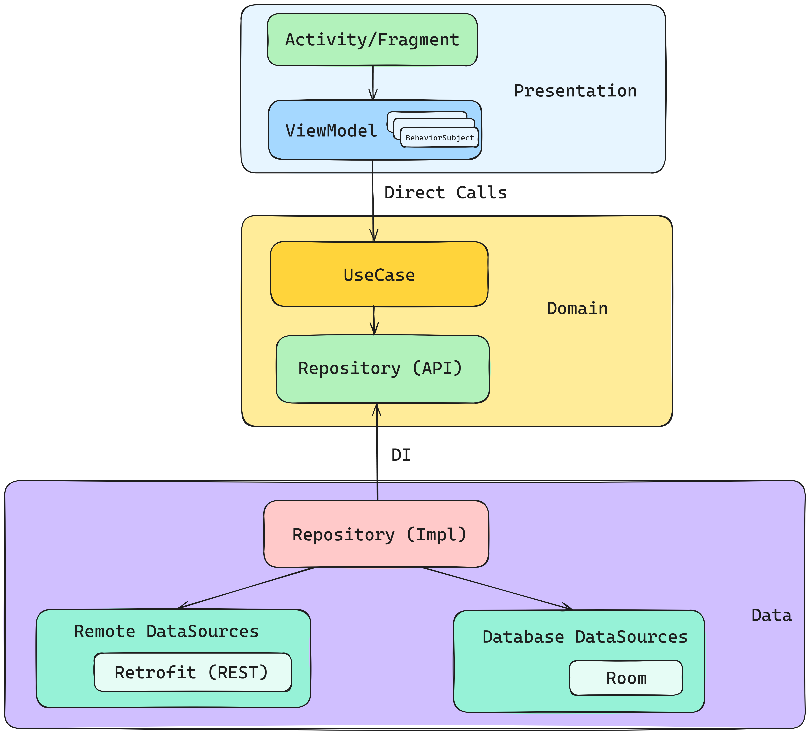

# AniShark

<a name="heading"></a>

## Содержание

- [Информация о приложении](#first)
- [Список используемых технологий и архитектура](#second)
    - [Список используемых технологий](#second-a)
    - [Архитектура](#second-b)
- [Технические детали реализации](#third)
    - [Структура пакетов и устройство приложения](#third-a)
    - [Особенности реализации архитектуры/структуры DI](#third-b)
    - [Что используется для хранения данных/многопоточной работы](#third-c)
- [Какому классу соответствует каждый экран](#fourth)

<a name="first"></a>

### Информация о приложении [К оглавлению](#heading)

Сделанные фичи:

 Фича             | Стадия       
------------------|--------------
 Домашний экран   | Готово       
 Каталог          | Готово       
 Закладки         | Готово       
 Фильтры каталога | Готово       
 Поиск            | Почти готово 
 Экран аниме      | Готово       

<a name="second"></a>

### Список используемых технологий и архитектура

<a name="second-a"></a>

#### Список используемых технологий [К оглавлению](#heading)

В приложении были использованы:

- Fragments
- ViewModel
- View Binding
- Room
- RxJava
- Retrofit (+ Kotlinx Serialization + HTTP Logging Interceptor)
- Dagger2/Hilt
- Jetpack Preferences DataStore (Rx)
- Ktlint

<a name="second-b"></a>

#### Архитектура [К оглавлению](#heading)

В приложении используется MVVM и чистая архитектура с 3 слоями - Data, Domain, Presentation.
Подробности ниже.

<a name="third"></a>

### Технические детали реализации

<a name="third-a"></a>

#### Структура пакетов и устройство приложения [К оглавлению](#heading)

В проекте используется чистая архитектура, то есть в приложении 3 слоя, и это отражается на
структуре пакетов:

- Data находится в [ru.anishark.app.data](./app/src/main/java/ru/anishark/app/data) и включает в
  себя
    - Папку ***db***, в которой находится код, связанный с хранением данных в SQLite БД, используя
      Room
    - Папку ***remote***, в которой находится код, связанный с получением данных по сети, используя
      Retrofit
    - Папку ***repository***, в которой находятся реализации репозиториев из доменного слоя
- Domain находится в [ru.anishark.app.domain](./app/src/main/java/ru/anishark/app/domain) и включает
  в себя
    - Папку ***model***, в которой находятся модели доменного слоя
    - Папку ***repository***, в которой находятся интерфейсы репозиториев
    - Папку ***usecase***, в которой находятся юзкейсы
- Presentation находится
  в [ru.anishark.app.presentation](./app/src/main/java/ru/anishark/app/presentation) и включает в
  себя
    - Папку ***anime***, в которой находится код, связанный с экраном информации об одном аниме
    - Папку ***bookmark***, в которой находится код, связанный с экраном закладок
    - Папку ***catalog***, в которой находится код, связанный с экраном каталога
    - Папку ***filter***, в которой находится код, связанный с экраном фильтра
    - Папку ***home***, в которой находится код, связанный с домашним экраном
    - Папку ***main***, в которой находится код, связанный с главным активити
      (которое содержит в себе домашний экран, экран каталога, экран закладок)
    - Папку ***search***, в которой находится код, связанный с поиском

<a name="third-b"></a>

#### Особенности реализации архитектуры/структуры DI [К оглавлению](#heading)

<details>



</details>

Для Presentation слоя выбран шаблон проектирования MVVM.

Юзкейсы зависят от абстракций репозиториев,
чтобы если что оттестировать их без привлечения моков и без нарушения Dependency Rule.

Реализации репозиториев связаны с их интерфейсами через DI
(связанные, т.е. binded реализации берутся из DI контейнера).
Они выполняют (в теории, на практике пока этого кода нет) роль выбора источника данных для
сохранения.
Условно, если нам потребуется кэшировать результат в базе, при этом основным источником будет сеть,
то такая архитектура позволит с минимальными затратами реализовать такое внутри реализации
репозитория.

Все модели начиная с DataSource и выше по цепочке вызовов являются доменными.
Для источников данных допускается иметь свои сущности (Entity, DBO...), либо DTO.

<a name="third-c"></a>

#### Что используется для хранения данных/многопоточной работы [К оглавлению](#heading)

Для хранения данных используются библиотеки Room (для представления данных)
и Jetpack Preferences DataStore (для хранения данных в формате ключ-значение).

В Room мы
храним [закладки](./app/src/main/java/ru/anishark/app/data/db/items/BookmarkAnimeEntity.kt).

Примерный DDL:

<details>

```sql
CREATE TABLE bookmarks(
    animeId INTEGER NOT NULL PRIMARY KEY,
    image TEXT,
    title TEXT
);
```

В датасторе мы храним текущую тему приложения.

RxJava используется во всех трёх слоях приложения - для работы Room и Retrofit с Observable были
добавлены
зависимости на соответствующие адаптеры вызовов.

</details>

<a name="fourth"></a>

### Какому классу соответствует каждый экран [К оглавлению](#heading)

- Домашнему экрану
  соответствует [HomeFragment](./app/src/main/java/ru/anishark/app/presentation/home/fragment/HomeFragment.kt)
- Экрану каталога
  соответствует [CatalogFragment](./app/src/main/java/ru/anishark/app/presentation/catalog/fragment/CatalogFragment.kt)
- Экрану закладок
  соответствует [BookmarkFragment](./app/src/main/java/ru/anishark/app/presentation/bookmark/fragment/BookmarkFragment.kt)
- Экрану деталей аниме
  соответствует [AnimeScreenActivity](./app/src/main/java/ru/anishark/app/presentation/anime/activity/AnimeScreenActivity.kt)
- Экрану фильтров каталога
  соответствует [FilterActivity](./app/src/main/java/ru/anishark/app/presentation/filter/activity/FilterActivity.kt)
- Экрану поиска
  соответствует [SearchFragment](./app/src/main/java/ru/anishark/app/presentation/search/fragment/SearchFragment.kt)