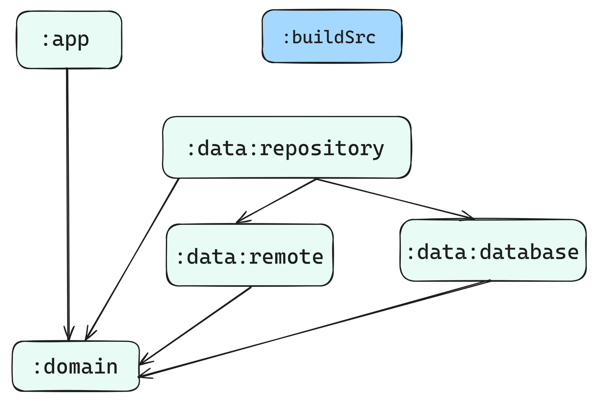

# AniShark

<a name="heading"></a>

## Содержание

- [Информация о приложении](#first)
- [Список используемых технологий и архитектура](#second)
    - [Список используемых технологий](#second-a)
    - [Архитектура](#second-b)
- [Технические детали реализации](#third)
    - [Структура пакетов и устройство приложения](#third-a)
    - [Особенности реализации архитектуры/структуры DI](#third-b)
    - [Что используется для хранения данных/многопоточной работы](#third-c)
    - [Многомодульность](#third-d)
- [Какому классу соответствует каждый экран](#fourth)

<a name="first"></a>

### Информация о приложении [К оглавлению](#heading)

AniShark - мобильное приложение-вики для поиска аниме.

Создатели:

- [Дмитрий Абдуллаев](https://github.com/MiddleShamil)
- [Александр Ерешкин](https://github.com/AlexEreh)
- [Александр Губанов](https://github.com/AleksandrPravdin)

Дизайн собственный, [ссылка](https://www.figma.com/design/sIVIyUVphZiYJoK3KyPGl6/AniShark).

Техническое задание: [ссылка](https://anishark.notion.site/794aedc3f949470e8a24b4eaea5f851f)

Флоу:

[Весь флоу (видео)](https://drive.google.com/file/d/1jfCaLUm38YSFK-7hM6CxJNobE7HyChM1/view?usp=sharing)

- [Домашний экран (видео)](https://drive.google.com/file/d/1Ag0DlJvARmY3hvlWyOj51nOMd9kUD9q5/view?usp=drive_link)
- [Каталог (видео)](https://drive.google.com/file/d/10NiQibCLzihaPt1sVir647D8z7AKDw0C/view?usp=drive_link)
- [Экран фильтров каталога (видео)](https://drive.google.com/file/d/1uJV8Ipq8MVhtuspEEECjnZu8y5dOkFLu/view?usp=drive_link)
- [Экран закладок (видео)](https://drive.google.com/file/d/1wZ6wuozfc7e50fxr64esTCdOFZSZ-nLY/view?usp=sharing)
- [Экран поиска (видео)](https://drive.google.com/file/d/1u02fPLXhRVYhIHQDuynXg8dUt1QvUapo/view?usp=drive_link)
- [Экран деталей аниме (фото)](https://drive.google.com/file/d/14QdZmgCLIluSZOLdY44ssKzR2ILgTGFb/view?usp=drive_link)
- [Сплэш-экран(видео)](https://drive.google.com/file/d/1aISBJV4Sr1vgS3Cy_-8_zd22YqWQOc4F/view?usp=drive_link) - не совсем флоу, но да ладно

Приложение использует [Jikan API](https://docs.api.jikan.moe/) как основной источник данных

Сделанные фичи:

 Фича             | Стадия                 
------------------|------------------------
 Домашний экран   | Готово (минорные баги) 
 Каталог          | Готово                 
 Закладки         | Готово                 
 Фильтры каталога | Готово                 
 Поиск            | Готово                 
 Экран аниме      | Готово                 

<a name="second"></a>

### Список используемых технологий и архитектура

<a name="second-a"></a>

#### Список используемых технологий [К оглавлению](#heading)

В приложении были использованы:

- Fragments
- ViewModel
- View Binding
- Room (кэширование + хранение закладок аниме на устройстве)
- RxJava
- Retrofit (+ Kotlinx Serialization + HTTP Logging Interceptor)
- Dagger2/Hilt
- Jetpack Preferences DataStore (Rx)
- Ktlint

<a name="second-b"></a>

#### Архитектура [К оглавлению](#heading)

В приложении используется MVVM и чистая архитектура с 3 слоями - Data, Domain, Presentation.
Подробности ниже.

<a name="third"></a>

### Технические детали реализации

<a name="third-a"></a>

#### Структура пакетов и устройство приложения [К оглавлению](#heading)

В проекте используется чистая архитектура, то есть в приложении 3 слоя, и это отражается на
структуре пакетов:

- Data находится в [ru.anishark.data](./data) (папка модулей) и включает в
  себя
    - Подпакет [***database***](./data/database/src/main/java/ru/anishark/data/database), в котором
      находится код, связанный с хранением данных в SQLite БД, используя
      Room
    - Подпакет [***remote***](./data/remote/src/main/java/ru/anishark/data/remote), в котором
      находится код, связанный с получением данных по сети, используя
      Retrofit
    - Подпакет [***repository***](./data/repository/src/main/java/ru/anishark/data/repository), в
      котором находятся реализации репозиториев из доменного слоя
- Domain находится в [ru.anishark.domain](./domain/src/main/java/ru/anishark/domain) (модуль :
  domain) и включает
  в себя
    - Подпакет ***model***, в котором находятся модели доменного слоя
    - Подпакет ***repository***, в котором находятся интерфейсы репозиториев
    - Подпакет ***usecase***, в котором находятся юзкейсы
- Presentation находится
  в [ru.anishark.app.presentation](./app/src/main/java/ru/anishark/app/presentation) (модуль :app) и
  включает в
  себя
    - Подпакет ***anime***, в котором находится код, связанный с экраном информации об одном аниме
    - Подпакет ***bookmark***, в котором находится код, связанный с экраном закладок
    - Подпакет ***catalog***, в котором находится код, связанный с экраном каталога
    - Подпакет ***filter***, в котором находится код, связанный с экраном фильтра
    - Подпакет ***home***, в котором находится код, связанный с домашним экраном
    - Подпакет ***main***, в котором находится код, связанный с главным активити
      (которое содержит в себе домашний экран, экран каталога, экран закладок)
    - Подпакет ***search***, в котором находится код, связанный с поиском

<a name="third-b"></a>

#### Особенности реализации архитектуры/структуры DI [К оглавлению](#heading)


Для Presentation слоя выбран шаблон проектирования MVVM.

Юзкейсы зависят от абстракций репозиториев,
чтобы если что оттестировать их без привлечения моков и без нарушения Dependency Rule.

Реализации репозиториев связаны с их интерфейсами через DI
(связанные, т.е. binded реализации берутся из DI контейнера).
Они выполняют (в теории, на практике пока этого кода нет) роль выбора источника данных для
сохранения.
Условно, если нам потребуется кэшировать результат в базе, при этом основным источником будет сеть,
то такая архитектура позволит с минимальными затратами реализовать такое внутри реализации
репозитория.

Все модели начиная с DataSource и выше по цепочке вызовов являются доменными.
Для источников данных допускается иметь свои сущности (Entity, DBO...), либо DTO.

<a name="third-c"></a>

#### Что используется для хранения данных/многопоточной работы [К оглавлению](#heading)

Для хранения данных используются библиотеки Room (для представления данных)
и Jetpack Preferences DataStore (для хранения данных в формате ключ-значение).

В Room мы
храним [закладки](./data/database/src/main/java/ru/anishark/data/database/dbo/BookmarkDBO.kt),
[топы](./data/database/src/main/java/ru/anishark/data/database/dbo/TopAnimeDBO.kt),
[актуальные аниме](./data/database/src/main/java/ru/anishark/data/database/dbo/ActualAnimeDBO.kt)

Примерный DDL:

```sql
CREATE TABLE bookmarks(
    animeId INTEGER NOT NULL PRIMARY KEY,
    image TEXT,
    title TEXT NOT NULL
);

CREATE TABLE topAnime(
    animeId INTEGER NOT NULL PRIMARY KEY,
    image TEXT,
    title TEXT NOT NULL,
    episodes INTEGER,
    rating REAL
);

CREATE TABLE actualAnime(
    animeId INTEGER NOT NULL PRIMARY KEY,
    image TEXT,
    title TEXT NOT NULL,
    episodes INTEGER,
    rating REAL
);
```

В датасторе мы храним текущую тему приложения.

RxJava используется во всех трёх слоях приложения - для работы Room и Retrofit с Observable были
добавлены зависимости на соответствующие адаптеры вызовов.

<a name="third-d"></a>

### Многомодульность [К оглавлению](#heading)



В модуле build-logic есть подмодуль convention, в котором 2 Gradle Convention плагина:

- Библиотека AniShark, доставляет в зависимости к модулям AGP (библиотечный), Kotlin, RxJava,
  RxKotlin, Dagger2/Hilt
- Приложение AniShark, доставляет в зависимости к модулям AGP (приложение), Kotlin, RxJava,
  RxKotlin, Dagger2/Hilt

:data - папка с подмодулями :data:repository (реализации репозиториев), :data:database (БД), :data:
remote (сеть)
:domain - юзкейсы, модели, интерфейсы репозиториев
:app - презентационная логика и остальное

<a name="fourth"></a>

### Какому классу соответствует каждый экран [К оглавлению](#heading)

- Домашнему экрану
  соответствует [HomeFragment](./app/src/main/java/ru/anishark/app/presentation/home/fragment/HomeFragment.kt)
- Экрану каталога
  соответствует [CatalogFragment](./app/src/main/java/ru/anishark/app/presentation/catalog/fragment/CatalogFragment.kt)
- Экрану закладок
  соответствует [BookmarkFragment](./app/src/main/java/ru/anishark/app/presentation/bookmark/fragment/BookmarkFragment.kt)
- Экрану деталей аниме
  соответствует [AnimeScreenActivity](./app/src/main/java/ru/anishark/app/presentation/anime/activity/AnimeScreenActivity.kt)
- Экрану фильтров каталога
  соответствует [FilterActivity](./app/src/main/java/ru/anishark/app/presentation/filter/activity/FilterActivity.kt)
- Экрану поиска
  соответствует [SearchFragment](./app/src/main/java/ru/anishark/app/presentation/search/fragment/SearchFragment.kt)